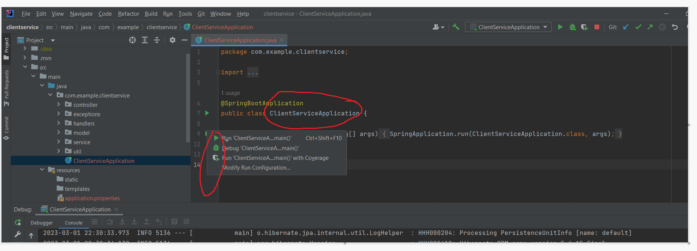
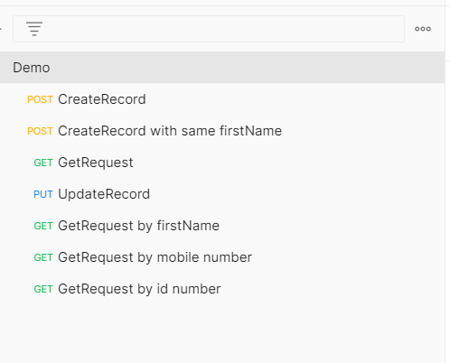

Demo Project
# Getting Started

## Softwares used. 
1. Intellij,
2. Java 8
3. Postman
4. Spring boot framework
5. Maven
6. Git, Github

## how to run the application



As shown in the above image open the ClientServiceApplication click on the green colour run symbol and click on run option. 

### Reference Documentation
There are 3 apis 
1. Create Client 
2. Update Client
3. Search Client


### Sample Postman collection is attached in the repo root location 

### 

For successful cases please follow the same order in which the collection requests are there.

NOTE:- for put request take any refid for the previous two create Record  and use it in the path variable of put url

### 1. Create Client: This API is used for creating a client

#### API Details
     url:- http://localhost:8080/client/
     METHOD:- POST
####  Sample payload
```
    {
    "firstName": "Che",
    "lastName": "p",
    "mobileNumber": 723457869,
    "idNumber": 7806062507085,
    "address": "Midrand,Johannesburg"
}
```
####  Sample response payload
```
    {
    "refId": "0289f6ed-c48a-4f72-887a-f787b966b35f",
    "firstName": "Che",
    "lastName": "p",
    "mobileNumber": 723457869,
    "idNumber": 7806062507085,
    "address": "Midrand,Johannesburg"
}
```

### 2. Update Client: This API is used for updating a client

#### API Details
     url:- http://localhost:8080/client/update/{refId}
     METHOD:- PUT
```
    sample url : http://localhost:8080/client/update/0289f6ed-c48a-4f72-887a-f787b966b35f
```
####  Sample payload
```
{
    "mobileNumber": "789654322"
}
```

#### Sample response payload

```
{
    "refId": "0289f6ed-c48a-4f72-887a-f787b966b35f",
    "firstName": "Che",
    "lastName": "p",
    "mobileNumber": 789654322,
    "idNumber": 7806062507085,
    "address": "Midrand,Johannesburg"
}
```

### 3. Search Client: This API is used for searching a client


#### API Details
     url:- http://localhost:8080/client/
     METHOD:- GET

## Search by first name
####  Sample payload
```
{
    "firstName": "che"
}
```

#### Sample response payload

```
[
    {
        "refId": "0289f6ed-c48a-4f72-887a-f787b966b35f",
        "firstName": "Che",
        "lastName": "p",
        "mobileNumber": 789654322,
        "idNumber": 7806062507085,
        "address": "Midrand,Johannesburg"
    }
]
```

## Search by Id number
####  Sample payload
```
{
    "idNumber": 7806062507085
}
```

#### Sample response payload

```
[
    {
        "refId": "0289f6ed-c48a-4f72-887a-f787b966b35f",
        "firstName": "Che",
        "lastName": "p",
        "mobileNumber": 789654322,
        "idNumber": 7806062507085,
        "address": "Midrand,Johannesburg"
    }
]
```
## Search by mobile number
####  Sample payload
```
{
    "mobileNumber": 789654322
}
```

#### Sample response payload

```
[
    {
        "refId": "0289f6ed-c48a-4f72-887a-f787b966b35f",
        "firstName": "Che",
        "lastName": "p",
        "mobileNumber": 789654322,
        "idNumber": 7806062507085,
        "address": "Midrand,Johannesburg"
    }
]
```
